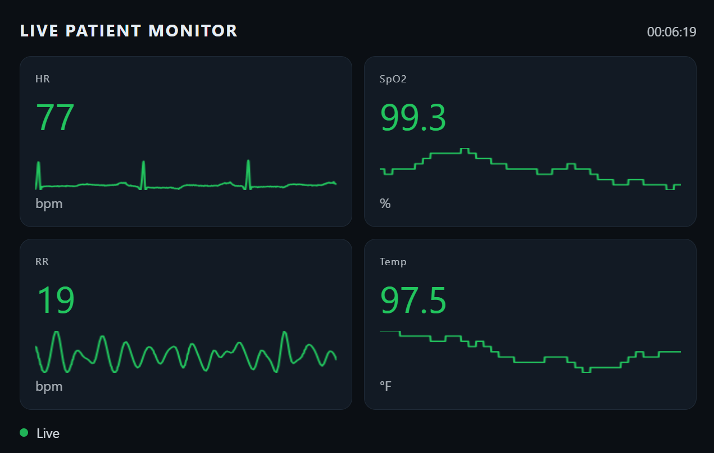

# Vital Monitoring and ML Anomaly Detection (Work in Progress)



This project is a Python-based prototype for real-time vital sign monitoring and future machine learning–driven anomaly detection.

The system now integrates historical physiological waveform data from PhysioNet using the WFDB library. Instead of fully simulated signals, the platform streams real ECG data from the MIT-BIH Arrhythmia Database and derives physiological metrics from those records in real time.

No real patient-identifiable data is used. All datasets are publicly available, anonymized research records.

---

## Project Goal

The long-term objective is to build a modular pipeline capable of:

- Streaming physiological signals in real time
- Establishing physiological baselines
- Detecting abnormal patterns using statistical and machine learning methods
- Supporting edge-device deployment (e.g., Raspberry Pi)
- Providing waveform visualization for monitoring and research validation
- Training time-series ML models using real biomedical datasets

At this stage, the focus is on clean architecture, realistic signal flow, and preparing structured data suitable for future ML ingestion.

---

## Current Capabilities

The system currently:

- Streams real ECG waveform data from PhysioNet (MIT-BIH database)
- Uses WFDB to load and process historical biomedical records
- Derives heart rate (HR) from ECG signals
- Implements ECG-Derived Respiration (EDR) for respiratory rate (RR) estimation
- Simulates additional vitals:
  - Oxygen Saturation (SpO₂)
  - Temperature
- Provides live waveform visualization in a web dashboard:
  - ECG waveform (HR)
  - Derived respiration waveform (RR)
- Exposes a REST API endpoint for real-time vital streaming
- Maintains modular separation between signal ingestion, processing, and presentation

This creates a realistic physiological signal pipeline suitable for future anomaly detection modeling.

---

## Data Source

This project uses:

- MIT-BIH Arrhythmia Database
- Accessed via the WFDB Python library
- Downloaded from PhysioNet

These records contain anonymized historical ECG data and are widely used in biomedical signal processing research.

The system reads raw ECG waveforms and processes them to generate derived physiological metrics in real time.

---

## Project Structure

```
pi5_Files/
│
├── app.py                      # Flask server and real-time update loop
├── base.py                     # Console monitoring interface
│
├── data/
│   ├── raw/mitdb/              # PhysioNet MIT-BIH records
│   └── physionet_hr_stream.py  # HR streaming logic from ECG
│
├── monitors/
│   ├── ox.py                   # Oxygen simulation logic
│   ├── respRate.py             # Respiration utilities
│   └── temp.py                 # Temperature simulation logic
│
├── templates/
│   └── index.html              # Web dashboard layout
│
├── static/
│   ├── app.js                  # Frontend polling and waveform rendering
│   └── style.css               # Dashboard styling
│
├── scripts/
│   └── download_mitdb.py       # Dataset download helper
│
└── .venv/                      # Local virtual environment
```

Older experimental scripts and hardware abstraction layers remain in the repository and may be refactored as the architecture stabilizes.

---

## How to Run

### First-Time Setup (one time only)

Download the MIT-BIH dataset from PhysioNet:

```
python scripts/download_mitdb.py
```

This will populate:

```
data/raw/mitdb/
```

---

### 1. Create a Virtual Environment

From the project root:

```
python -m venv .venv
```

### 2. Activate the Environment (Windows)

```
.\.venv\Scripts\activate
```

### 3. Install Dependencies

```
python -m pip install --upgrade pip
pip install flask wfdb numpy
```

---

### 4. Start the Web Dashboard

```
python app.py
```

Open a browser and navigate to:

```
http://127.0.0.1:5000
```

You will see:

- Live ECG waveform
- Derived respiration waveform
- Current HR, RR, SpO₂, and temperature values

---

### 5. (Optional) Run the Console Monitor

```
python base.py
```

The console version is primarily used to validate data flow and derived metrics during development.

---

## Development Focus

The active development priorities are:

- Maintaining a clean time-series data pipeline
- Using real biomedical datasets for model preparation
- Structuring signals for sliding-window ML ingestion
- Ensuring compatibility with future anomaly detection models
- Keeping UI lightweight while prioritizing signal integrity

---

## Planned Machine Learning Work

Future stages will introduce:

- Sliding-window feature extraction from ECG and EDR
- Baseline modeling per vital stream
- Statistical anomaly detection
- Frequency-domain respiration analysis
- Sequence modeling (LSTM / Transformer-based approaches)
- Drift detection across physiological signals
- Offline training using historical PhysioNet records
- Real-time inference integration into the streaming loop

The architecture is intentionally modular so models can be inserted without restructuring the signal pipeline.

---

## Data Policy

This project uses:

- Publicly available, anonymized biomedical research datasets
- No personally identifiable health data
- No live patient streaming

All data usage complies with PhysioNet’s research access policies.

---

## Intended Applications

This architecture is being designed as a foundation for:

- Edge-based health monitoring systems
- Continuous biometric analysis platforms
- Biomedical signal research prototypes
- ML-driven physiological anomaly detection systems
- Real-time inference engines operating on streaming medical signals

---

## Status

| Component | Status |
|----------|--------|
PhysioNet Integration | Implemented |
WFDB Signal Processing | Implemented |
ECG Waveform Streaming | Implemented |
EDR Respiration Derivation | Implemented |
Flask Dashboard | Implemented |
Waveform Visualization | Implemented |
Sensor Integration (Hardware) | Planned |
ML Training Pipeline | In Design |
Anomaly Detection Models | Not Yet Implemented |

---


This repository represents an evolving research prototype focused on building a realistic physiological signal pipeline using real biomedical data. The current phase establishes a strong foundation for meaningful anomaly detection experimentation and future machine learning integration.

